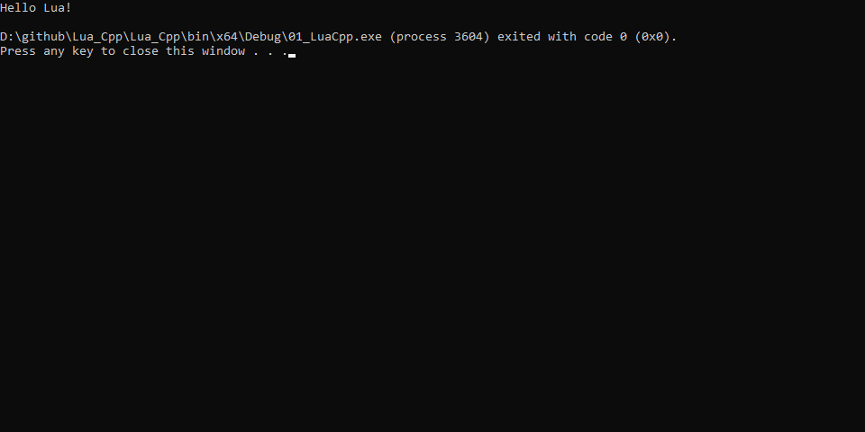
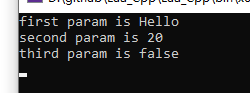
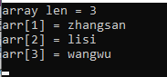
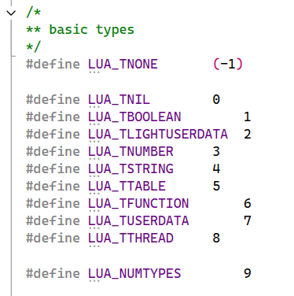

# Lua_Cpp
an example show how to interact with c++ and lua


### 一. 源码编译Lua

**1 编译lua为动态库**

源码来源于目录下:  lua-5.4.7.tar.gz

(1) 创建C++ DLL项目

所有lua源代码加入工程,  需要修改一下lua.c中的main,  改个名字,不然冲突

(2) 修改Output Directory**[仅规范性要求]**

```
$(SolutionDir)..\bin\$(Platform)\$(Configuration)\
```

(3) 添加宏 **LUA_BUILD_AS_DLL**,  表明编译lua以**动态库**导出

(4) 修改导入库路径**[仅规范性要求]**

```
$(SolutionDir)..\lib\$(Platform)\$(Configuration)\
```


**2 添加C++测试库**

(1) 修改输出目录, 为了和DLL同目录

```
$(SolutionDir)..\bin\$(Platform)\$(Configuration)\
```

(2) 添加头文件包含目录

```
$(SolutionDir)LuaDLL\lua
```

(3) 添加库路径

```
$(SolutionDir)..\lib\$(Platform)\$(Configuration)
```

(4) 添加链接库

```
LuaDLL.lib
```

(5) 添加测试代码

```c++
extern "C"
{
    #include "lua.h"
    #include "lauxlib.h"
    #include "lualib.h"
}

int main()
{
    lua_State* L = luaL_newstate();
    luaopen_base(L);
    luaL_loadfile(L, "first.lua");
    lua_pcall(L, 0, 0, 0);

    return 0;
}
```

(6) 添加lua文件**[放在输出目录下]**

```
print('Hello Lua!')
```

(7) 运行测试工程




### 二. Lua调用C++函数[传普通参数]

**1 注册函数到lua**

```
lua_register(L, "CTest", CTest);
```


**2 封装cpp函数**

获取lua传来的参数, 然后操作

```cpp
int CTest(lua_State* L)
{
    const char* first_param = lua_tostring(L, 1); //获取第一个参数, 字符串类型
    printf("first param is %s\n", first_param);

    int second_param = lua_tonumber(L, 2); //获取第二个参数, Number类型
    printf("second param is %d\n", second_param);

    bool third_param = lua_toboolean(L, 3); //获取第三个参数, boolean类型
    printf("third param is %s\n", third_param ? "true" : "false");

    return 0; //表示0个返回值
}
```


**3  lua调用cpp封装的函数**

```lua
CTest("Hello", 20, false)
```


**4 结果**




### 三. Lua调用C++函数[传数组参数]


类似的注册不多赘述, 主要贴下**CPP代码**

```cpp
int CTest(lua_State* L)
{
    //1 获取数组长度
    //2 遍历数组元素
    lua_len(L, 1); //获取栈底的数据长度, 把它压栈
    int arrLen = lua_tointeger(L, -1);
    printf("array len = %d\n", arrLen);
    lua_pop(L, 1);

    for(int i = 1; i <= arrLen; i++)
    {
        lua_pushnumber(L, i); //压入访问下标
        lua_gettable(L, 1); //pop下标, 压入对应下标元素
        printf("arr[%d] = %s\n", i, lua_tostring(L, -1));
        lua_pop(L, 1); //弹出元素
    }

    return 0; //表示0个返回值
}
```


**lua 代码**

```lua
CTest({'zhangsan', 'lisi', 'wangwu'})
```


**结果:** 




### 四. Lua调用C++函数[传Table参数和变量类型检查]


***1 遍历Table***

**CPP代码**

```cpp
int Test_TableParam(lua_State* L)
{
    lua_pushnil(L); //nil作为第一个key,这是遍历规则

    //根据当前栈底判断key是否存在后续,有就弹出key,压入后一个元素的key和value
    while(lua_next(L, 1) != 0) 
    {
        printf("key = %s ", lua_tostring(L, -2));
        printf("value = %s \n", lua_tostring(L, -1));
        lua_pop(L, 1);
    }
    
    return 0;
}
```

**lua代码**

```lua
local t = {
	name = "xiaoming",
	age = "20",
	sex = "男"
}
Test_TableParam(t)
```


***2 访问Table指定Key***

**CPP代码**

```cpp
int Test_GetField(lua_State* L)
{
    lua_getfield(L, 1, "name");
    printf("table[name] = %s ", lua_tostring(L, -1));
    lua_pop(L, 1);

    return 0;
}
```

**lua代码**

```lua
local t = {
	name = "xiaoming",
	age = "20",
	sex = "男"
}
--Test_TableParam(t)
Test_GetField(t)
```


***3 参数类型检查***

lua有两种:  

**(1) luaL_checktype**

这种是强制类型检查,  类型不匹配直接退出

**(2) lua_type** 

这种类似获取类型,  通过返回值给出

**lua的类型有以下:**




**CPP代码**

```cpp
int Test_CheckType(lua_State* L)
{
    luaL_checktype(L, 1, LUA_TTABLE);

    if(lua_type(L, 1) != LUA_TTABLE)
    {
        printf("type is not table!\n");
    }

    return 0;
}
```

**lua代码**

```lua
Test_CheckType(1)
Test_CheckType({1,2})
```


