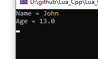
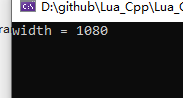
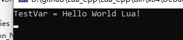
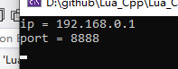
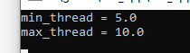
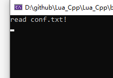
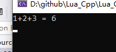
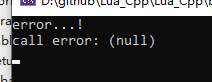
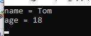
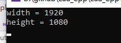

# Lua_Cpp
an example show how to interact with c++ and lua


### 一. 源码编译Lua

**1 编译lua为动态库**

源码来源于目录下:  lua-5.4.7.tar.gz

(1) 创建C++ DLL项目

所有lua源代码加入工程,  需要修改一下lua.c中的main,  改个名字,不然冲突

(2) 修改Output Directory**[仅规范性要求]**

```
$(SolutionDir)..\bin\$(Platform)\$(Configuration)\
```

(3) 添加宏 **LUA_BUILD_AS_DLL**,  表明编译lua以**动态库**导出

(4) 修改导入库路径**[仅规范性要求]**

```
$(SolutionDir)..\lib\$(Platform)\$(Configuration)\
```


**2 添加C++测试库**

(1) 修改输出目录, 为了和DLL同目录

```
$(SolutionDir)..\bin\$(Platform)\$(Configuration)\
```

(2) 添加头文件包含目录

```
$(SolutionDir)LuaDLL\lua
```

(3) 添加库路径

```
$(SolutionDir)..\lib\$(Platform)\$(Configuration)
```

(4) 添加链接库

```
LuaDLL.lib
```

(5) 添加测试代码

```c++
extern "C"
{
    #include "lua.h"
    #include "lauxlib.h"
    #include "lualib.h"
}

int main()
{
    lua_State* L = luaL_newstate();
    luaopen_base(L);
    luaL_loadfile(L, "first.lua");
    lua_pcall(L, 0, 0, 0);

    return 0;
}
```

(6) 添加lua文件**[放在输出目录下]**

```
print('Hello Lua!')
```

(7) 运行测试工程


### 二. Lua调用C++函数[传普通参数]

**1 注册函数到lua**

```
lua_register(L, "CTest", CTest);
```


**2 封装cpp函数**

获取lua传来的参数, 然后操作

```cpp
int CTest(lua_State* L)
{
    const char* first_param = lua_tostring(L, 1); //获取第一个参数, 字符串类型
    printf("first param is %s\n", first_param);

    int second_param = lua_tonumber(L, 2); //获取第二个参数, Number类型
    printf("second param is %d\n", second_param);

    bool third_param = lua_toboolean(L, 3); //获取第三个参数, boolean类型
    printf("third param is %s\n", third_param ? "true" : "false");

    return 0; //表示0个返回值
}
```


**3  lua调用cpp封装的函数**

```lua
CTest("Hello", 20, false)
```


**4 结果**


### 三. Lua调用C++函数[传数组参数]


类似的注册不多赘述, 主要贴下**CPP代码**

```cpp
int CTest(lua_State* L)
{
    //1 获取数组长度
    //2 遍历数组元素
    lua_len(L, 1); //获取栈底的数据长度, 把它压栈
    int arrLen = lua_tointeger(L, -1);
    printf("array len = %d\n", arrLen);
    lua_pop(L, 1);

    for(int i = 1; i <= arrLen; i++)
    {
        lua_pushnumber(L, i); //压入访问下标
        lua_gettable(L, 1); //pop下标, 压入对应下标元素
        printf("arr[%d] = %s\n", i, lua_tostring(L, -1));
        lua_pop(L, 1); //弹出元素
    }

    return 0; //表示0个返回值
}
```


**lua 代码**

```lua
CTest({'zhangsan', 'lisi', 'wangwu'})
```


**结果:** 


### 四. Lua调用C++函数[传Table参数和变量类型检查]


***1 遍历Table***

**CPP代码**

```cpp
int Test_TableParam(lua_State* L)
{
    lua_pushnil(L); //nil作为第一个key,这是遍历规则

    //根据当前栈底判断key是否存在后续,有就弹出key,压入后一个元素的key和value
    while(lua_next(L, 1) != 0) 
    {
        printf("key = %s ", lua_tostring(L, -2));
        printf("value = %s \n", lua_tostring(L, -1));
        lua_pop(L, 1);
    }
    
    return 0;
}
```

**lua代码**

```lua
local t = {
	name = "xiaoming",
	age = "20",
	sex = "男"
}
Test_TableParam(t)
```


***2 访问Table指定Key***

**CPP代码**

```cpp
int Test_GetField(lua_State* L)
{
    lua_getfield(L, 1, "name");
    printf("table[name] = %s ", lua_tostring(L, -1));
    lua_pop(L, 1);

    return 0;
}
```

**lua代码**

```lua
local t = {
	name = "xiaoming",
	age = "20",
	sex = "男"
}
--Test_TableParam(t)
Test_GetField(t)
```


***3 参数类型检查***

lua有两种:  

**(1) luaL_checktype**

这种是强制类型检查,  类型不匹配直接退出

**(2) lua_type** 

这种类似获取类型,  通过返回值给出

**lua的类型有以下:**


**CPP代码**

```cpp
int Test_CheckType(lua_State* L)
{
    luaL_checktype(L, 1, LUA_TTABLE);

    if(lua_type(L, 1) != LUA_TTABLE)
    {
        printf("type is not table!\n");
    }

    return 0;
}
```

**lua代码**

```lua
Test_CheckType(1)
Test_CheckType({1,2})
```


### 五. Lua调用C++函数[有返回值]


**1  普通返回值**

**CPP代码**

```cpp
int Test_ReturnNormalValue(lua_State* L)
{
    lua_pushnumber(L, 99); //第一个返回值
    lua_pushstring(L, "Hello World!"); //第二个返回值

    return 2; //返回1个值
}
```

**lua代码**

```lua
id, str = Test_ReturnNormalValue()
print(id, str)
```


**2 Table返回值**

**CPP代码**

```cpp
int Test_ReturnTableValue(lua_State* L)
{
    lua_newtable(L);

    //插入第一对key,value
    lua_pushstring(L, "Name");
    lua_pushstring(L, "John");
    lua_settable(L, -3); //弹出{key, value}到-3指向的表

    //插入第二对key,value
    lua_pushstring(L, "Age");
    lua_pushnumber(L, 13);
    lua_settable(L, -3);

    return 1; //返回1个值
}
```

**lua代码**

```lua
local t = Test_ReturnTableValue()
print("Name = " .. t.Name)
print("Age = " .. t.Age)
```

**结果:**




### 六. C++获取和设置Lua的全局变量

**(1) 获取Lua全局变量**

**CPP代码**

```cpp
void Test_GetLuaVar(lua_State* L)
{
    lua_getglobal(L, "Width");
    int width = lua_tonumber(L, -1);
    lua_pop(L, 1);
    printf("width = %d\n", width);
}
```

**lua代码**

```lua
Width = 1080;
```

**结果:**




**(2) 设置Lua全局变量**

**CPP代码**

```cpp
void Test_SetLuaVar(lua_State* L)
{
    lua_pushstring(L, "Hello World Lua!");
    lua_setglobal(L, "TestVar"); //弹出栈顶, 设置全局变量名称为TestVar
}
```

**lua代码**

```lua
print("TestVar = " .. TestVar)
```

**结果:**




### 七. C++获取和设置Lua的表类型变量

**获取表类型变量**

**CPP代码**

```cpp
void Test_GetLuaTable(lua_State* L)
{
    lua_getglobal(L, "conf"); //获取conf变量,压入栈顶
    lua_getfield(L, -1, "ip"); //获取key为ip的值,压入栈顶
    printf("ip = %s\n", lua_tostring(L, -1));
    lua_pop(L, 1); //出栈ip的值

    lua_getfield(L, -1, "port");
    printf("port = %d\n", lua_tointeger(L, -1));
    lua_pop(L, 2); //出栈port的值和conf变量
}
```

**lua代码**

```lua
conf = {
	ip = "192.168.0.1",
	port = 8888
}
```

**结果:**




**设置表类型变量**

**CPP代码**

```cpp
void Test_SetLuaTable(lua_State* L)
{
    lua_newtable(L);
    lua_pushstring(L, "min_thread_num");
    lua_pushnumber(L, 5);
    lua_settable(L, -3);

    lua_pushstring(L, "max_thread_num");
    lua_pushnumber(L, 10);
    lua_settable(L, -3);

    lua_setglobal(L, "thread_conf");
}
```

**lua代码**

```lua
print("min_thread = " .. thread_conf.min_thread_num)
print("max_thread = " .. thread_conf.max_thread_num)
```

**结果:**




### 八. C++调用Lua的函数

***带参数. 但无返回值***

**CPP代码**

```cpp
void CallLuaFunction_NoReturn(lua_State* L)
{
    lua_getglobal(L, "readfile");
    lua_pushstring(L, "conf.txt");
    if(lua_pcall(L, 1, 0, 0) != 0)
    {
        const char* error = lua_tostring(L, -1);
        printf("call error: %s\n", error);
    }
}
```

**lua代码**

```lua
function readfile(filename)
	print('read ' .. filename .. "!")
end
```

**结果:**




***带参数. 也有返回值***

**CPP代码**

```cpp
void CallLuaFunction_HasReturn(lua_State* L)
{
    lua_getglobal(L, "MySum");
    lua_pushnumber(L, 1); //第一个参数
    lua_pushnumber(L, 2); //第二个参数
    lua_pushnumber(L, 3); //第三个参数
    if(lua_pcall(L, 3, 1, 0) != 0)
    {
        const char* error = lua_tostring(L, -1);
        printf("call error: %s\n", error);
    }
    else
    {
        printf("1+2+3 = %d\n", lua_tointeger(L, -1)); //获取返回值
        lua_pop(L, 1);
    }
}
```

**lua代码**

```lua
function MySum(...)
	local args = {...}
	local sum = 0
	for i, v in ipairs(args) do
		sum = sum + v
	end
	return sum
end
```

**结果:**




***指定错误处理函数为lua的函数***

**CPP代码**

```cpp
void CallLuaFunction_HasErrorFunc(lua_State* L)
{
    lua_getglobal(L, "err_cb");
    int errfuncIndex = lua_gettop(L); //获取err_cb在栈的位置

    lua_getglobal(L, "MyTest");
    lua_pushstring(L, "Hello");
    //传入错误处理
    if(lua_pcall(L, 1, 0, errfuncIndex) != 0)
    {
        const char* error = lua_tostring(L, -1);
        printf("call error: %s\n", error);
    }
}
```

**lua代码**

```lua
function err_cb()
	print("error...!")
end

function MyTest(str)
	local s = str - 1 --故意产生错误
	print("Test..")
end
```

**结果:**




### 九. C++调用Lua的函数,带Table类型

**参数为Table类型**

**CPP代码**

```cpp
void CallLuaFunc_TableParam(lua_State* L)
{
    lua_getglobal(L, "PrintPerson");
    lua_newtable(L);
    lua_pushstring(L,"name");
    lua_pushstring(L,"Tom");
    lua_settable(L, -3);
    lua_pushstring(L,"age");
    lua_pushinteger(L,18);
    lua_settable(L, -3);

    if(lua_pcall(L, 1, 0, 0) != 0)
    {
        const char* error = lua_tostring(L, -1);
        printf("call error: %s\n", error);
    }
}
```

**lua代码**

```lua
function PrintPerson(person)
	print('name = ' .. person.name)
	print('age = ' .. person.age)
end
```

**结果:**




**返回值为Table类型**

**CPP代码**

```cpp
void CallLuaFunc_TableParam2(lua_State* L)
{
    lua_getglobal(L, "GetConf");
    if(lua_pcall(L, 0, 1, 0) != 0)
    {
        const char* error = lua_tostring(L, -1);
        printf("call error: %s\n", error);
    }
    else
    {
        lua_getfield(L, -1, "width");
        printf("width = %d\n", lua_tointeger(L, -1));
        lua_pop(L, 1);

        lua_getfield(L, -1, "height");
        printf("height = %d\n", lua_tointeger(L, -1));
        lua_pop(L, 1);
    }
    lua_pop(L, 1);
}
```

**lua代码**

```lua
function GetConf()
	local ret = {
		width = 1920,
		height = 1080
	}
	return ret
end
```

**结果:**




**目前这么多, 应该够用了, 其他的可以自行查阅文档, 欢迎大家Star!  谢谢,我是黑狗!**


